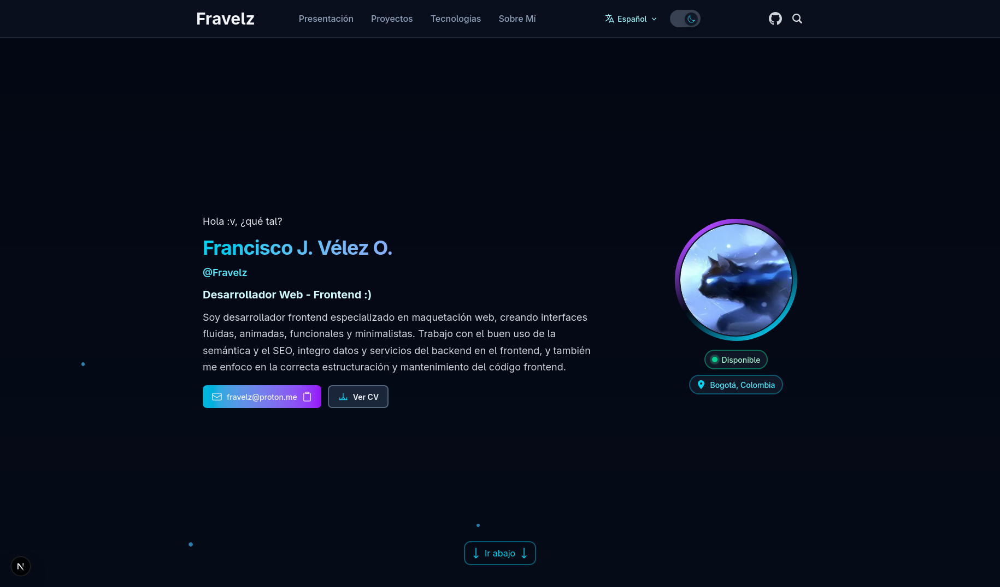

# Fravelz's Portfolio

[Version en Español](./README.md)

This is the code and documentation for my portfolio. It's my profile for companies, showcasing both the website's visual appeal and the clean, organized code structure, with corresponding and up-to-date documentation for every code change.

I'm Fravelz (Francisco Velez), a Front-End Developer. My goal is simple: to be one of the best front-end programmers in the world and eventually work at Google.

This portfolio, along with other projects that will be under construction, being improved, and completed, will demonstrate my progress and the details I consider to achieve my goal.

All web projects modified, created, or last modified in 2026 will have documentation in both Spanish and English, with code comments and commits in English. This makes for multilingual projects, with English as the primary language because it's the international standard in programming. (This applies to personal projects.)

---

## 📋 Table of Contents

- [Fravelz's Portfolio](#fravelzs-portfolio)
  - [📋 Table of Contents](#-table-of-contents)
  - [Technologies](#technologies)
    - [Core](#core)
    - [Development Tools](#development-tools)
    - [Documentation Tools](#documentation-tools)
  - [✅ Best Practices Implemented](#-best-practices-implemented)
    - [Performance](#performance)
    - [Accessibility](#accessibility)
    - [SEO](#seo)
    - [Code](#code)
    - [Extra Features](#extra-features)
  - [🤝 Contribute](#-contribute)
  - [📄 License](#-license)
  - [👤 Author](#-author)

---

## Technologies

### Core

- Astro v5.16.11 - Modern web framework
- React v19.1.1 - UI library for interactive components
- TypeScript - Static typing
- Tailwind CSS v4.1.0 - Utility-first CSS framework

### Development Tools

- pnpm - Fast package manager
- **Vite** - Build tool (included in Astro)

### Documentation Tools

- VS Code extension: Markdown All in One
- VS Code extension: Markdownlint
- VS Code extension: Code Spell Checker

---

## ✅ Best Practices Implemented

### Performance

- ✅ Pre-rendered static HTML
- ✅ Lazy loading of React components
- ✅ Optimized images
- ✅ Critical inline CSS
- ✅ Minimum bundle size

### Accessibility

- ✅ HTML5 semantic tags
- ✅ ARIA labels on interactive elements
- ✅ Keyboard navigation
- ✅ Appropriate color contrast
- ✅ Alternative text for images

### SEO

- ✅ Complete meta tags (Open Graph, Twitter Cards)
- ✅ Sitemap.xml
- ✅ Robots.txt
- ✅ Semantic Structure
- ✅ Clean URLs

### Code

- ✅ TypeScript for type safety
- ✅ Reusable components
- ✅ Separation of concerns
- ✅ Modular structure
- ✅ Descriptive comments

### Extra Features

[Go to features...](./docs/es/features.md)

---

## 🤝 Contribute

[Go to project structure...](./docs/es/structure.md)

[Go to contribution manual...](./docs/es/contribution.md)

[Go to architecture...](./docs/es/architecture.md)

[Go to feedback...](./docs/es/feedback.md)

---

## 📄 License

MIT - Permissive Open Source License

---

## 👤 Author

**Fravelz** - [GitHub](https://github.com/FraVelz) - fravelz@proton.me
